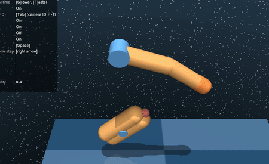
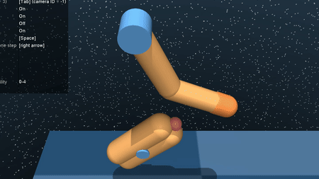
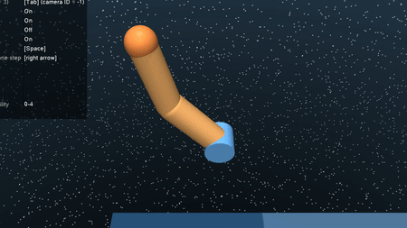
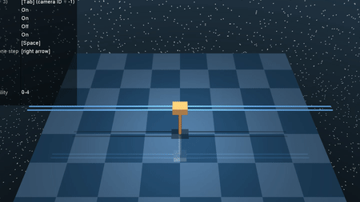
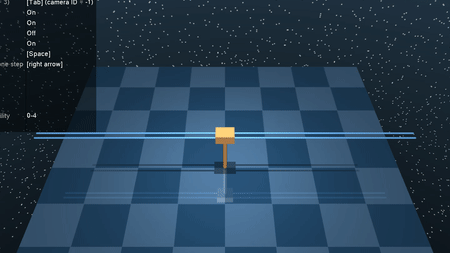

# Overview

This repo is primarily based on implementation of trajectory optimisation algorithms. The two main algorithms implemented atm are iLQR and MPPI.
The **app** directory has the source files for both algorithms running on environments such as finger-spinner, cartpole, acrobot, double integrator in the context of an MPC loop.

# Tasks
The gifs below show iLQR and MPPI working on different environments
- iLQR (Finger Spinner)

 

- MPPI (Finger Spinner)

- iLQR (Acrobot)

- iLQR (Cartpole)

- MPPI (Cartpole)

